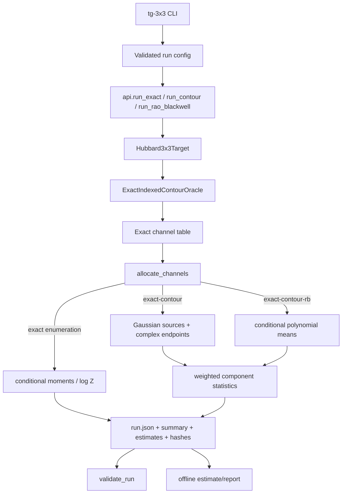

# 3x3 Hubbard Sampler

This repository is a small, exact reference implementation of a periodic
`3x3` auxiliary-field Hubbard target with one Euclidean-time slice. Its main
purpose is to make a finite-dimensional contour decomposition and its Monte
Carlo estimators executable, inspectable, and easy to compare against exact
enumeration.

The important scope boundary is:

> `n_t=1` means one slice of Euclidean imaginary time. It is not real-time
> evolution, a multi-slice finite-temperature simulation, or a general Hubbard
> solver.

In short, `n_t=1` represents Euclidean imaginary time, not real-time
evolution.

Within that fixed scope the package can:

- construct the target weight on the real field space;
- expand both fermion determinants into exactly `3^9 = 19,683` Fourier
  channels;
- translate each channel to a complex Gaussian contour;
- integrate the Gaussian source analytically for the approved polynomial
  observables;
- sample channels with either the exact categorical law or a defensive
  importance proposal; and
- write validated, reproducible JSON reports and optional contour samples.

The mathematical derivation below is also a map of the implementation. A
reader or coding agent should be able to start with the equations, follow the
module links, and understand the complete execution path without reconstructing
the design from tests alone.

## Installation

The package requires Python 3.11 or 3.12, NumPy, and PyTorch.

```bash
git clone https://github.com/konstantin8wolgin/3x3-sampler.git
cd 3x3-sampler
python3 -m venv .venv
. .venv/bin/activate
python -m pip install .
```

The installed command is `tg-3x3`; the import package is
`taylorgauss_3x3`.

## A mathematical overview

### 1. Geometry and notation

There are nine sites labelled by coordinates

\[
(r,c)\in\{0,1,2\}^2,
\qquad i=3r+c\in\{0,\ldots,8\}.
\]

The lattice is periodic in both directions. Every site is connected to its
right and down neighbour, with indices reduced modulo three. Because the
matrix is made symmetric, this gives the square-lattice nearest-neighbour
matrix with periodic wrapping:

\[
H_{ij}=\begin{cases}
1,& i\text{ and }j\text{ are periodic nearest neighbours},\\
0,&\text{otherwise}.
\end{cases}
\]

`H` is real symmetric, `9 x 9`, and every site has degree four. The exact
construction is [`square_3x3_hopping`](src/taylorgauss_3x3/core/hubbard.py),
and the target object that owns the matrix is
[`Hubbard3x3Target`](src/taylorgauss_3x3/core/hubbard.py).

The auxiliary field is a vector

\[
\phi=(\phi_0,\ldots,\phi_8)\in\mathbb R^9.
\]

The four physical parameters are:

| Symbol | CLI/API name | Meaning | Default |
|---|---|---|---:|
| \(U\) | `U` | interaction scale; must be positive | `2.0` |
| \(\beta\) | `beta` | Euclidean-time extent; must be positive | `1.5` |
| \(\kappa\) | `kappa` | hopping scale | `1.0` |
| \(\mu\) | `mu_chem` | chemical potential parameter | `0.75` |

The implementation uses

\[
A=\frac1{U\beta},
\qquad
B_+=e^{\kappa\beta H}e^{\mu\beta},
\qquad
B_-=e^{-\kappa\beta H}e^{-\mu\beta}.
\]

The scalar factors in \(B_\pm\) multiply the whole matrix. Since `H` is real
symmetric, \(e^{\pm\kappa\beta H}\) is symmetric positive definite. The
chemical-potential factors are positive real scalars, so both \(B_+\) and
\(B_-\) are positive definite whenever the parameters pass validation.

The implementation constructs these matrices with `torch.matrix_exp` in
[`Hubbard3x3Target.__init__`](src/taylorgauss_3x3/core/hubbard.py).

### 2. The real-axis target

For a real field, define

\[
z_i=e^{i\phi_i},
\qquad
z_i^{-1}=e^{-i\phi_i}.
\]

The implemented one-slice weight is

\[
W(\phi)=
\exp\left(-\frac A2\phi^T\phi\right)
\det\left(I+B_+\operatorname{diag}(e^{i\phi})\right)
\det\left(I+B_-\operatorname{diag}(e^{-i\phi})\right).
\tag{1}
\]

Here `diag(e^{i phi})` means the diagonal matrix with entries
\(e^{i\phi_0},\ldots,e^{i\phi_8}\). The real-axis evaluator is
[`Hubbard3x3Target.evaluate`](src/taylorgauss_3x3/core/hubbard.py).

For a complex field the package uses the holomorphic continuation of (1):

\[
W_{\mathrm{hol}}(\phi)=
\exp\left(-\frac A2\sum_i\phi_i^2\right)
\det\left(I+B_+\operatorname{diag}(e^{i\phi_i})\right)
\det\left(I+B_-\operatorname{diag}(e^{-i\phi_i})\right).
\tag{2}
\]

Here \(\phi_i^2\), not \(|\phi_i|^2\), is used. Likewise, the second
determinant uses `exp(-1j * phi)` literally; it does not use a complex
conjugate. This distinction is essential when evaluating translated contour
points. The implementation is [`evaluate_holomorphic`](src/taylorgauss_3x3/core/hubbard.py).

The real-axis integrand is generally complex. The positivity result below is
about the coefficients of the channel representation, not a claim that (1) is
a positive probability density pointwise on \(\mathbb R^9\).

### 3. Determinant expansion and the `3^9` channels

For any `9 x 9` matrix \(B\) and diagonal variables
\(D(z)=\operatorname{diag}(z_0,\ldots,z_8)\), the principal-minor identity is

\[
\det(I+B D(z))
=\sum_{S\subseteq\{0,\ldots,8\}}
\det(B_{S,S})\prod_{i\in S}z_i.
\tag{3}
\]

There are \(2^9=512\) subsets. For the first determinant, let
\(a_i\in\{0,1\}\) indicate membership in \(S_+\). For the second determinant,
the factor \(e^{-i\phi_i}\) gives an exponent \(b_i\in\{-1,0\}\). Multiplying
the determinants combines them into

\[
e^{i a\cdot\phi}e^{i b\cdot\phi}
=e^{i n\cdot\phi},
\qquad n=a+b,
\qquad n_i\in\{-1,0,1\}.
\]

Thus the product has at most, and here exactly,

\[
K=3^9=19,683
\]

distinct channel labels \(n\in\{-1,0,1\}^9\). The coefficient of a label is
the convolution

\[
c_n=\sum_{a+b=n}
\det\bigl((B_+)_{S(a),S(a)}\bigr)
\det\bigl((B_-)_{S(-b),S(-b)}\bigr),
\tag{4}
\]

where \(S(a)=\{i:a_i=1\}\) and \(S(-b)=\{i:b_i=-1\}\). The implementation
does this in two stages:

1. [`_principal_minor_poly`](src/taylorgauss_3x3/core/hubbard.py) enumerates
   all subset minors for one determinant and stores exponent tuples as keys.
2. [`_poly_mul`](src/taylorgauss_3x3/core/hubbard.py) multiplies the two finite
   polynomials and adds terms with equal exponent tuples.

Because every principal minor of a positive-definite matrix is positive,
including the empty minor \(\det(B_{\varnothing,\varnothing})=1\), every
coefficient \(c_n\) is positive. For any desired label `n`, choose
\(a_i=1\) when \(n_i=1\), \(b_i=-1\) when \(n_i=-1\), and choose zero for
the remaining component. This gives at least one strictly positive summand in
(4).

Therefore (1) has the finite expansion

\[
W(\phi)=\sum_{n\in\{-1,0,1\}^9}
c_n\exp\left(-\frac A2\phi^T\phi\right)e^{i n\cdot\phi}.
\tag{5}
\]

The complete expansion is built by
[`Hubbard3x3Target.exact_indexed_oracle`](src/taylorgauss_3x3/core/hubbard.py),
which also checks symmetry, positive definiteness, the exact channel count,
and positivity. It sorts the exponent tuples lexicographically and stores
them as rows of `oracle.modes`. A `channel` integer in later code is the row
index into this sorted table.

### 4. Completing the square: translated Gaussian contours

For one channel, complete the square in (5):

\[
\begin{aligned}
\exp\left(-\frac A2\phi^T\phi+i n\cdot\phi\right)
&=\exp\left(-\frac{\lVert n\rVert^2}{2A}\right)
  \exp\left[-\frac A2
  \left(\phi-\frac{i n}{A}\right)^T
  \left(\phi-\frac{i n}{A}\right)\right].
\end{aligned}
\tag{6}
\]

The contour center for channel `n` is therefore

\[
m_n=\frac{i n}{A}=iU\beta n.
\tag{7}
\]

The translated real Gaussian source is

\[
x\sim\mathcal N(0,A^{-1}I_9),
\qquad
z=x+m_n.
\tag{8}
\]

The positive channel mass, omitting the common normalized-Gaussian factor,
is

\[
M_n=c_n\exp\left(-\frac{\lVert n\rVert^2}{2A}\right).
\tag{9}
\]

The contour translation has unit Jacobian. Since the integrand is a finite
sum of entire functions, the real integral can be translated channel by
channel, giving the common Gaussian integral times the sum of the masses.
The oracle stores `log(M_n)` rather than relying only on `M_n`, so very small
channels can remain usable in log-space even if their linear float64 mass
underflows.

The implementation of (6)--(9) is split across:

- [`ExactIndexedContourOracle.means`](src/taylorgauss_3x3/core/indexed.py),
  which returns `1j * modes / precision`;
- [`channel_log_masses`](src/taylorgauss_3x3/core/indexed.py), which stores
  \(\log M_n\); and
- [`channel_probabilities`](src/taylorgauss_3x3/core/indexed.py), which
  normalizes the log masses with `torch.logsumexp`.

For the current positive channel representation,

\[
p_n=\frac{M_n}{\sum_m M_m}
\tag{10}
\]

is an ordinary categorical probability distribution. The general oracle data
model also carries a channel phase \(\eta_n\), but the Hubbard construction
sets \(\eta_n=1\) for every channel and the stochastic estimators explicitly
require this positive-phase contract.

The reported physical log partition follows the package convention

\[
\log Z
=\log\left(\sum_n M_n\right)+\beta\mu N_s,
\qquad N_s=9.
\tag{11}
\]

The first term is evaluated by `physical_log_partition` in
[`core/observables.py`](src/taylorgauss_3x3/core/observables.py); the chemical
potential factor in (11) is added explicitly there. This is a one-slice,
exponentially discretized quantity, not the exact continuum-time thermal
partition function.

The following diagram summarizes the mathematical reduction:

```mermaid
flowchart LR
    A[Real field phi in R^9] --> B[Two fermion determinants]
    B --> C[512 principal-minor terms each]
    C --> D[Polynomial convolution]
    D --> E[19,683 labels n in {-1,0,1}^9]
    E --> F[Mass M_n and center i U beta n]
    F --> G[Categorical channel law p_n]
    G --> H[Gaussian source x]
    H --> I[Contour endpoint z = x + i U beta n]
    G --> J[Rao-Blackwell conditional polynomial moment]
```

## Observables and exact conditional moments

The supported stochastic observables are entire polynomials of degree at most
two:

\[
O(z)=c+\ell^Tz+z^TQz.
\tag{12}
\]

Only the symmetric part

\[
Q_s=\frac12(Q+Q^T)
\]

contributes to the quadratic form. The package freezes three examples in
[`approved_observables`](src/taylorgauss_3x3/core/observables.py):

- `quadratic_mean_field`: \(z^T I z/9\);
- `mixed_linear_quadratic`: a linear ramp from `-0.4` to `0.4` plus the same
  quadratic term; and
- `odd_linear`: the average of the nine field components.

For channel `n`, write `z = m_n + x` with the real Gaussian `x` from (8), and
let \(\sigma^2=A^{-1}\). The exact conditional mean is

\[
\mathbb E_n[O]
=c+\ell^Tm_n+m_n^TQ_sm_n+\sigma^2\operatorname{tr}(Q_s).
\tag{13}
\]

The implementation is [`EntirePolynomial.conditional_moments`](src/taylorgauss_3x3/core/observables.py).
It also forms the conditional squared fluctuation diagnostic

\[
\mathbb E_n\left[|O-\mathbb E_nO|^2\right]
=\sigma^2\left\lVert\ell+2Q_sm_n\right\rVert_2^2
 +2\sigma^4\left\lVert Q_s\right\rVert_F^2.
\tag{14}
\]

For the positive channel law, the exact expectation of a polynomial is simply

\[
\mathbb E[O]
=\sum_n p_n\,\mathbb E_n[O].
\tag{15}
\]

The generic exact-enumeration routine retains the phase-aware form

\[
\mathbb E[O]
=\frac{\sum_n p_n\eta_n\mathbb E_n[O]}
        {\sum_n p_n\eta_n},
\tag{16}
\]

which reduces to (15) because \(\eta_n=1\) here.

## Algorithms

### Exact enumeration

`exact-enumeration` performs no random sampling. The execution is:

```text
target  = Hubbard3x3Target(U, beta, kappa, mu_chem)
oracle  = target.exact_indexed_oracle()
values  = observable.conditional_moments(oracle.means, oracle.precision)
result  = weighted sum over all 19,683 channel means
```

For `physical_log_partition`, it evaluates (11) directly. For the three
polynomials it evaluates (13) for every channel and combines them with (16).
This is the reference calculation against which the stochastic estimators are
tested.

### Channel allocation and proposal distributions

All end-to-end stochastic runs first call
[`allocate_channels`](src/taylorgauss_3x3/sampling.py). Let `K = 19,683` and let
`p_n` be (10). Two proposals are available:

1. **Exact categorical:**

   \[
   q_n=p_n,
   \qquad
   w_n=\frac{p_n}{q_n}=1.
   \tag{17}
   \]

2. **Defensive half-uniform importance proposal:**

   \[
   q_n=\frac12p_n+\frac1{2K},
   \qquad
   w_n=\frac{p_n}{q_n}.
   \tag{18}
   \]

The second proposal gives every channel nonzero support, including channels
whose float64 probability is too small for direct categorical sampling. The
estimator is unbiased because

\[
\mathbb E_{n\sim q}\left[w_n f(n)\right]
=\sum_n q_n\frac{p_n}{q_n}f(n)
=\mathbb E_{n\sim p}[f(n)].
\tag{19}
\]

The proposal correction is stored as `log_design_weight = log(p_n/q_n)`.
The exact rational proposal masses are obtained from the binary floating-point
representations of the probabilities. A SHA-256 counter-based generator then
draws a uniform integer by rejection sampling and maps it into cumulative
integer mass intervals. Consequently record `j` is determined by
`(algorithm_version, domain, seed, j)` rather than by the order in which a
parallel worker happens to execute.

The relevant implementation pieces are:

- `_represented_integer_masses`: converts float64 probabilities to common
  dyadic integer masses;
- `_counter_uniform_below`: exact rejection sampling for an integer interval;
- `_channel_from_uniform_integer`: interval lookup with binary search; and
- `ChannelAllocation`: the channel rows, proposal, correction, seed, and
  reproducibility metadata.

The convenience method `ExactIndexedContourOracle.sample` uses
`torch.multinomial` directly. The package-level stochastic run path uses the
record-indexed allocator above so the stored run is reproducible and can be
validated independently.

### Explicit contour estimator

For each allocated channel `n_j`, the explicit estimator draws

\[
x_j\sim\mathcal N(0,A^{-1}I_9),
\qquad z_j=x_j+m_{n_j},
\]

then evaluates the polynomial at the complex endpoint `z_j`. The estimator is

\[
\widehat O_{\mathrm{explicit}}
=\frac1N\sum_{j=1}^N
w_{n_j}\,\eta_{n_j}\,O(z_j).
\tag{20}
\]

For this Hubbard target \(\eta_n=1\) and the contour Jacobian is one. The
Gaussian source is generated with `torch.randn / sqrt(A)`. Each source record
gets a deterministic seed derived from the master seed and its record index.

The implementation is [`estimate_explicit_contour`](src/taylorgauss_3x3/sampling.py),
with source/endpoint transport supplied by
[`ExactIndexedContourOracle.sample_for_channels`](src/taylorgauss_3x3/core/indexed.py).

### Rao–Blackwellized estimator

The Rao–Blackwellized path uses the same channel allocation and the same
importance correction, but replaces the random endpoint value with the exact
conditional mean (13):

\[
\widehat O_{\mathrm{RB}}
=\frac1N\sum_{j=1}^N
w_{n_j}\,\eta_{n_j}\,\mathbb E_{n_j}[O].
\tag{21}
\]

It samples channels only. For an approved polynomial, (21) removes all
variance caused by the Gaussian source while preserving the channel-sampling
variance. Rao–Blackwellization analytically integrates the Gaussian source.
This is why `exact-contour-rb` is normally the preferred stochastic
method for the included observables.

The implementation is [`estimate_rao_blackwell`](src/taylorgauss_3x3/sampling.py),
which calls `conditional_moments` once and indexes the resulting channel means.

### Componentwise uncertainty and numerical stability

The estimator is complex, so real and imaginary components are treated
separately. For one component `Y_j`, the reported standard error is

\[
\operatorname{SE}(\overline Y)
=\sqrt{\frac{1}{N(N-1)}
\sum_{j=1}^N(Y_j-\overline Y)^2}.
\tag{22}
\]

The implementation does not materialize potentially overflowing weighted
values when it can avoid doing so. [`_log_component_statistics`](src/taylorgauss_3x3/sampling.py)
stores signed sums, squared sums, and a common logarithmic scale; the final
rescaling occurs in `_estimate_from_log_statistics`. This protects ordinary
float64 diagnostics from large or tiny importance weights, while still
rejecting nonfinite inputs.

`physical_log_partition` (the physical log partition) is analytic rather than
stochastic, so its reported standard errors are `null` even if a sample method
is requested.

## Effective sample size (ESS)

The repository currently does **not** write an ESS field into `summary.json`.
It reports the componentwise standard errors in (22) instead. When the
channel identities and proposal probabilities are available, the usual
realized importance-sampling ESS is

\[
\operatorname{ESS}
=\frac{\left(\sum_{j=1}^N w_j\right)^2}
       {\sum_{j=1}^N w_j^2}.
\tag{23}
\]

For the exact categorical design, \(w_j=1\), so ESS is exactly `N` and the
ESS fraction is 100%. For the defensive proposal, weights vary according to
(18), so ESS is below `N` and depends on the parameter point and realized
channel draws. The defensive design is a support safeguard, not a claim of
90% ESS.

This distinction matters for the stored artifacts:

- explicit contour runs with endpoint persistence store `channel_id` in
  `samples.zarr`, so (23) can be reconstructed from the run parameters;
- Rao–Blackwellized runs store sufficient statistics rather than every channel
  ID, so their exact realized ESS is not recoverable from the current artifact
  alone; and
- an ESS of 90% from a different amplitude-transport algorithm is not directly
  comparable to the exact-categorical channel ESS, because it measures a
  different proposal and estimator.

## How the code fits together

The end-to-end flow is:



### Module guide

| Module | Responsibility | Start here |
|---|---|---|
| [`core/hubbard.py`](src/taylorgauss_3x3/core/hubbard.py) | periodic geometry, `B_+`, `B_-`, real/holomorphic target, determinant expansion | `Hubbard3x3Target` |
| [`core/indexed.py`](src/taylorgauss_3x3/core/indexed.py) | mode table, masses, centers, source transport, channel sampling | `ExactIndexedContourOracle` |
| [`core/observables.py`](src/taylorgauss_3x3/core/observables.py) | polynomial definitions, (13), exact enumeration, (11) | `EntirePolynomial` |
| [`config.py`](src/taylorgauss_3x3/config.py) | fixed geometry/time-slice scope and CLI parameters | `ExactRunConfig`, `StochasticRunConfig` |
| [`sampling.py`](src/taylorgauss_3x3/sampling.py) | proposals, deterministic allocation, importance weights, estimators, SEs | `allocate_channels` |
| [`api.py`](src/taylorgauss_3x3/api.py) | small public façade over the implementation | `run_exact`, `run_rao_blackwell` |
| [`artifacts.py`](src/taylorgauss_3x3/artifacts.py) | run construction, JSONL sufficient statistics, hashing, validation | `write_run`, `validate_run` |
| [`storage.py`](src/taylorgauss_3x3/storage.py) | streaming endpoint storage | `ZarrStreamWriter` |
| [`reporting.py`](src/taylorgauss_3x3/reporting.py) | offline HTML/SVG report generation | `render_report` |
| [`cli.py`](src/taylorgauss_3x3/cli.py) | argument parser and command dispatch | `build_parser`, `main` |

The package intentionally keeps the mathematical core independent from the
artifact layer. You can use the core classes directly for a short numerical
experiment, or use the API/CLI when you need a validated reproducible run.

## Running the algorithms

### Exact reference calculation

This integrates all channels and all Gaussian sources analytically:

```bash
tg-3x3 sample \
  --method exact-enumeration \
  --observable mixed_linear_quadratic \
  --output runs/exact

tg-3x3 validate runs/exact
```

It creates no stochastic draws. The exact support count remains `19,683`; that
is the number of channels, not a sample count.

The same operation is available from Python:

```python
from taylorgauss_3x3 import ExactRunConfig, run_exact

run_exact(
    ExactRunConfig(observable="mixed_linear_quadratic"),
    "runs/exact-python",
)
```

### Rao–Blackwellized channel sampling

```bash
tg-3x3 sample \
  --method exact-contour-rb \
  --observable mixed_linear_quadratic \
  --samples 20000 \
  --seed 202609010001 \
  --channel-design iid_exact_categorical \
  --output runs/stochastic-rb

tg-3x3 validate runs/stochastic-rb
```

Use `--channel-design defensive_half_uniform_importance` to use (18). The
Rao–Blackwellized method does not persist Gaussian sources or endpoints,
because it integrates them analytically.

### Explicit contour sampling

```bash
tg-3x3 sample \
  --method exact-contour \
  --observable mixed_linear_quadratic \
  --samples 4096 \
  --seed 202609010001 \
  --output runs/explicit-contour
```

By default this persists `source`, `endpoint`, and `channel_id` arrays in
`samples.zarr`. Disable that storage with `--no-persist-endpoints` when only
the summary is needed.

## Output and validation

Each run writes a new directory containing:

- `run.json`: parameters, method, observable, seed, and scope;
- `summary.json`: complex estimate and componentwise standard errors;
- `estimates.jsonl`: exact result, structural result, or stochastic sufficient
  statistics by chunk;
- `report.html` and `figures/estimates.svg`: a small offline report;
- `hashes.json`: file sizes and SHA-256 digests; and
- `samples.zarr`: explicit source/endpoint/channel arrays when persistence is
  enabled.

The writer refuses to overwrite an existing run directory. After writing, it
calls [`validate_run`](src/taylorgauss_3x3/artifacts.py), which checks the
layout, scope, hashes, stored statistics, numerical finiteness, exact support,
and consistency between configuration and result. You can validate any
completed run independently:

```bash
tg-3x3 validate runs/explicit-contour
```

The `estimate` and `report` commands reproduce derived artifacts from stored
content without sampling again:

```bash
tg-3x3 estimate runs/explicit-contour --output runs/estimate-copy
tg-3x3 report runs/explicit-contour --output runs/report-copy
```

## Numerical correctness checks

The test suite checks the mathematical and software contracts at several
levels:

- the periodic hopping matrix is symmetric and has the intended geometry;
- real-axis and holomorphic evaluators agree with the determinant definitions;
- the channel expansion contains exactly `19,683` unique labels;
- principal-minor coefficients and channel masses are positive and finite in
  the supported regime;
- translated contour mixtures reproduce the target weight;
- conditional polynomial moments agree with direct Gaussian calculations;
- exact enumeration agrees with the canonical reference values;
- explicit and Rao–Blackwellized estimators have the correct sampling law;
- proposal corrections and deterministic allocations are reproducible;
- log-domain statistics reject nonfinite or malformed inputs; and
- clean wheel/sdist installations work outside the source checkout.

Run the tests and build locally with:

```bash
python -m pip install -e '.[dev]'
python -m pytest
python -m build
```

The default-parameter exact reference values are:

| Observable | Real part | Imaginary part |
|---|---:|---:|
| `quadratic_mean_field` | `1.2384040693411869` | `0.0` |
| `mixed_linear_quadratic` | `1.2384040693411869` | `-2.0508704419898993e-15` |
| `odd_linear` | `0.0` | `0.3228805203648307` |
| `physical_log_partition` | `32.36358464798972` | `0.0` |

## What this code does not claim

This is a fixed mathematical reference, not a production-scale Hubbard
simulation. It does not implement:

- multiple Euclidean-time slices or a continuum-time limit;
- larger lattices such as `4x4`;
- real-time dynamics;
- arbitrary or meromorphic observables;
- inverse matrices or Green functions as observables; or
- production sequential Monte Carlo.

There is no multi-slice, `4x4`, `3D`, Green-function, or production-SMC
implementation in this repository.

The complex contour endpoints are not ordinary real-axis samples. They are
complex auxiliary-field points rather than real-axis configurations. The
positive channel masses make exact categorical sampling
possible, but that should not be confused with pointwise positivity of the
original real-axis integrand. Finally, Monte Carlo standard errors describe
sampling variation only; they do not quantify discretization error, model
mismatch, or the effect of changing the one-slice target.
